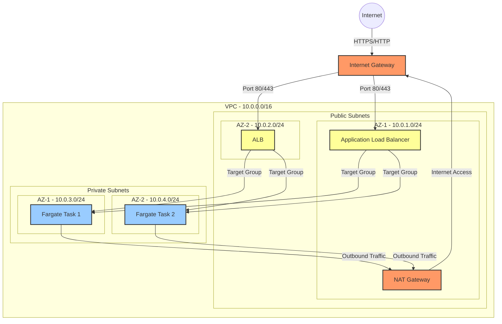

# AWS Fargate Network Flow Diagram

## Network Flow Description

1. **Internet to VPC**:
   - External traffic from the internet reaches the VPC through the Internet Gateway (IGW)
   - The IGW serves as the entry/exit point for all internet traffic

2. **Load Balancer Layer**:
   - Traffic is directed to Application Load Balancers in public subnets
   - ALBs are distributed across two Availability Zones for high availability
   - Security groups control inbound traffic to ALBs (typically ports 80/443)

3. **Container Layer**:
   - ALBs forward requests to Fargate tasks in private subnets
   - Tasks are distributed across AZs for high availability
   - Security groups control traffic between ALB and Fargate tasks

4. **Outbound Traffic Flow**:
   - Fargate tasks in private subnets use NAT Gateway for outbound internet access
   - NAT Gateway is placed in public subnet
   - Outbound traffic flows: Fargate Task → NAT Gateway → Internet Gateway → Internet

## Security Considerations

1. **Public Access Control**:
   - Only ALBs are in public subnets
   - Internet traffic can only reach the application through ALB

2. **Private Resources Protection**:
   - Fargate tasks run in private subnets
   - No direct internet access to containers
   - Outbound internet access controlled via NAT Gateway

3. **Network Isolation**:
   - Clear separation between public and private resources
   - Security groups provide additional layer of access control
   - Network ACLs can be used for subnet-level security